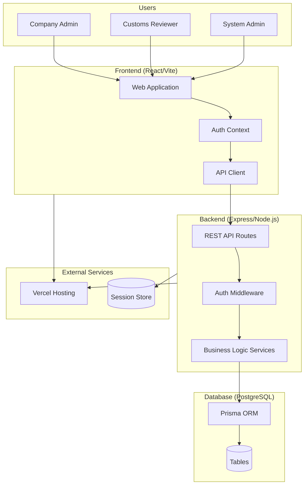
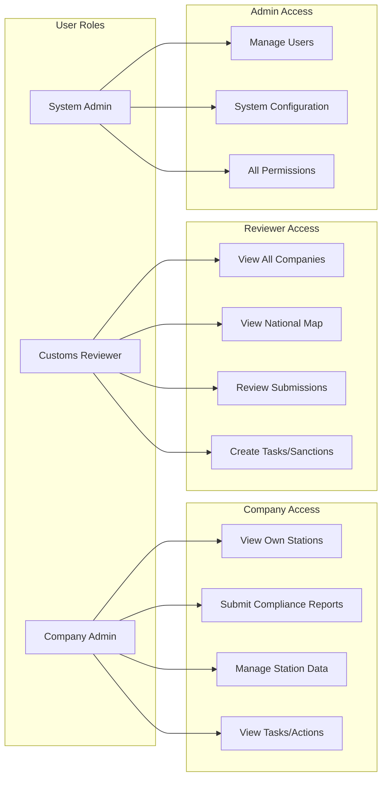
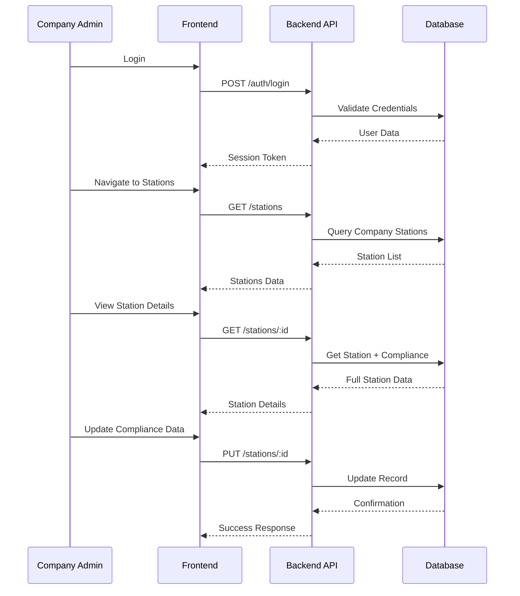
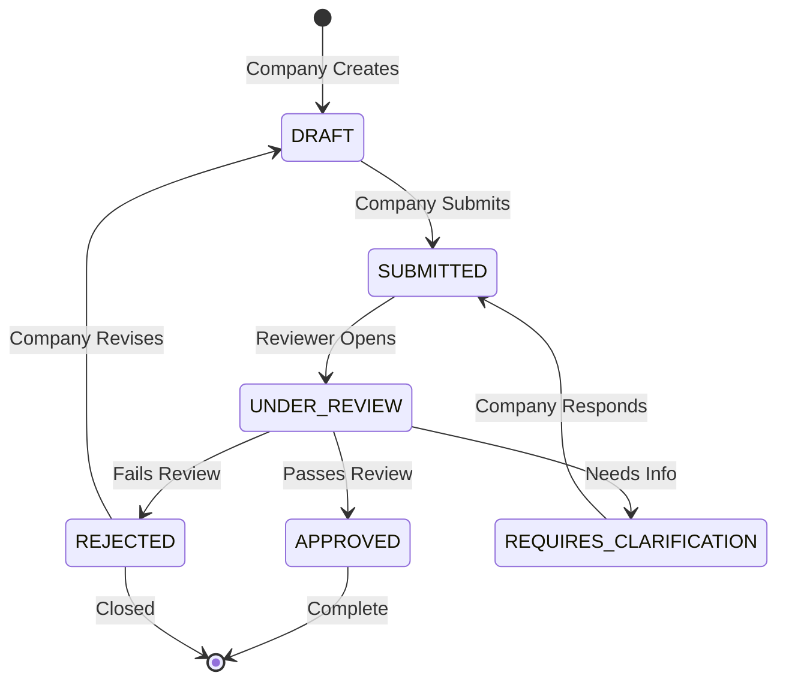
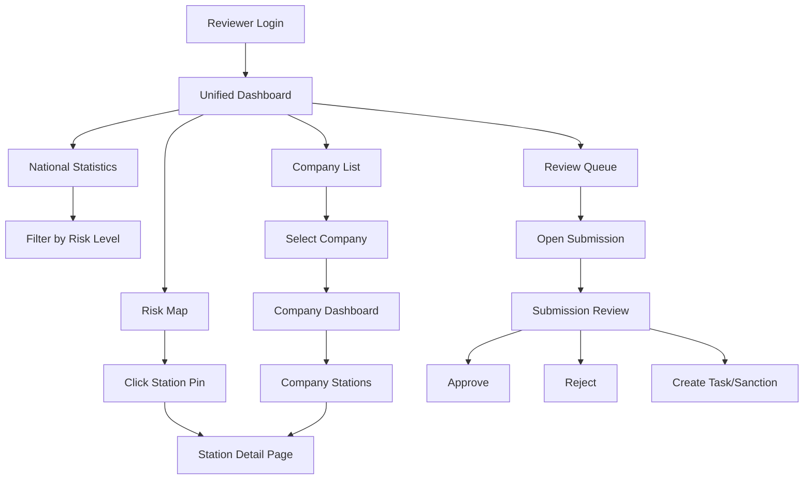
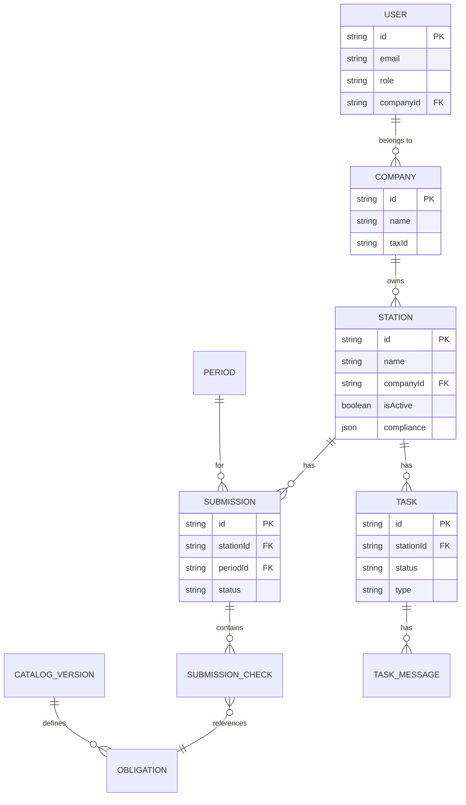
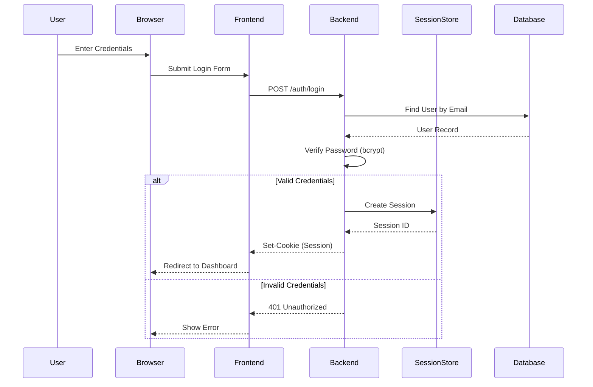

# System Architecture & Workflow Diagrams

This document provides visual representations of the Customs App architecture and key workflows.

---

## 1. High-Level System Architecture

---

## 2. User Role Permissions

---

## 3. Station Compliance Workflow

---

## 4. Submission Review Workflow

---

## 5. Reviewer Dashboard Flow

---

## 6. Database Entity Relationships

---

## 7. Authentication Flow

---

## Recommended Tools for Future Diagrams

| Tool | Best For | Notes |
|------|----------|-------|
| **Mermaid.js** | Code-based diagrams in Markdown | Already used here, renders in GitHub/VS Code |
| **Excalidraw** | Quick whiteboard-style sketches | Free, collaborative, hand-drawn feel |
| **Figma** | UI/UX mockups and prototypes | Industry standard for design |
| **Draw.io** | Complex flowcharts and ERDs | Free, exports to many formats |
| **Lucidchart** | Enterprise diagrams | Paid, good for formal documentation |
| **PlantUML** | UML diagrams from code | Good for sequence/class diagrams |

### Recommendation for This Project

For **technical documentation** (like this file): Use **Mermaid.js** - it lives in your codebase and updates with git.

For **stakeholder presentations**: Use **Excalidraw** or **Figma** - more polished visual output.

For **database modeling**: Use **dbdiagram.io** - specialized for ERD creation.
